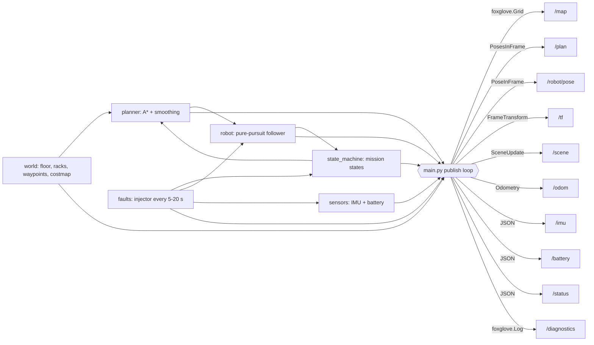

# demo-server

A self-contained synthetic data server for the DIY DVR panel demo. It streams a
single legible story: a **warehouse robot driving dock-to-dock** that plans
around shelving racks and hits a random "issue" every 5-20 seconds. Run it, watch
an issue land, and dump the DVR buffer to capture the incident window.

No hardware, no recordings, no external data — everything is generated on the fly.

## The story it tells

```
IDLE -> PLANNING -> DRIVING -> GOAL_REACHED -> PLANNING -> ...
                       |
                       v  (a fault fires)
                     ERROR -> RECOVERING -> PLANNING     (replan around the issue)

(battery low) ------------------------> CHARGING -> PLANNING
```

The robot A\*-plans a path over a costmap (static racks + any fault-dropped
blocker), follows it with a pure-pursuit controller, and streams pose / odometry
/ IMU / battery / status. Every 5-20 s the fault injector fires one of:

| Fault | Effect | Level |
|---|---|---|
| `motor_stall` | speed forced to 0 for ~2.5 s | error |
| `imu_tilt` | tilt + acceleration spike ~1.5 s | warning |
| `battery_sag` | undervoltage dip ~2 s | warning |
| `localization_jump` | one-shot pose teleport 0.4-0.8 m | warning |
| `obstacle_blocking` | drops a blocker ~2.5 m ahead, forcing a replan | error |

Each fault trips the mission into `ERROR`, logs a line on `/diagnostics`, and
steps the State Transitions panel.

## Data flow



## Topics

| Topic | Schema | Purpose |
|---|---|---|
| `/map` | `foxglove.Grid` | factory-floor costmap (uint8 cost, obstacle inflation); ~1 Hz |
| `/plan` | `foxglove.PosesInFrame` | planned path, current position to goal |
| `/robot/pose` | `foxglove.PoseInFrame` | current robot pose in `map` |
| `/tf` | `foxglove.FrameTransform` | `map` -> `base_link`, so the body attaches |
| `/scene` | `foxglove.SceneUpdate` | robot body + heading, goal marker, obstacles |
| `/odom` | `foxglove.Odometry` | odometry (pose + body twist) |
| `/imu` | JSON | linear acceleration, angular velocity, roll/pitch/yaw |
| `/battery` | JSON | percentage, voltage, current, charging |
| `/status` | JSON | `{ state, detail }` for the State Transitions panel |
| `/diagnostics` | `foxglove.Log` | fault lines for the Log panel |

Frames: `map` is the fixed world (grid, goal, obstacles, pose, plan); `base_link`
is the robot body, attached to `map` via `/tf` each tick.

## Run

Needs [`uv`](https://docs.astral.sh/uv/). Dependencies (`foxglove-sdk`, `numpy`)
come from `pyproject.toml`; `uv run` fetches them automatically.

```sh
uv run python main.py                 # ws://127.0.0.1:8765, 20 Hz
uv run python main.py --seed 1        # deterministic fault sequence
uv run python main.py --rate-hz 30    # faster publish rate
uv run python main.py --port 9000     # override the port
uv run python main.py --host 0.0.0.0  # expose on the network
```

Or use the start/stop wrapper:

```sh
./serve.sh start        # start detached, logs to .logs/demo-server.log
./serve.sh status       # show the running server
./serve.sh logs         # tail the log
./serve.sh stop         # kill whatever is on port 8765
```

## Connect

In the Foxglove app: **Open connection -> Foxglove WebSocket -> `ws://127.0.0.1:8765`**
(the default). Then import `layout.json` (**Layouts -> Import from file**) for a
ready-made view: a 3D panel (map + scene + plan + pose), IMU and battery plots, a
State Transitions panel on `/status`, and a Log panel on `/diagnostics`.

Add the **DIY DVR** panel and hit record to capture the buffer around the next
fault.

## Tests

```sh
uv run python test_sim.py
```

Steps the simulation in fake time (no server) and asserts the path plans, the
robot moves, the battery drains while driving, a fault fires early, and the
mission visits both `DRIVING` and `ERROR`. Regression coverage also asserts:

- a low battery **docks, charges, and resumes** rather than dead-sticking on the charger, and
- the robot's **footprint never overlaps a rack** across a 3-minute run (planner clearance).

Also constructs and encodes every Foxglove message to catch SDK-construction regressions.
